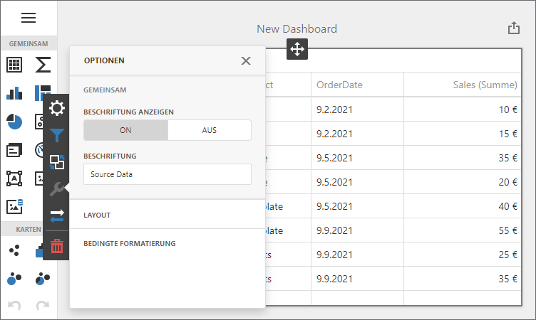

<!-- default badges list -->

<!-- default badges end -->
# BI Dashboard for JavaScript Applications - Localization
<!-- run online -->
**[[Run Online]](https://codecentral.devexpress.com/336046657/)**
<!-- run online end -->

The example shows how to localize the Dashboard control in JavaScript applications:

- Translate UI element captions to a different language: dialog boxes, buttons, menu items, error messages, etc.
- Format numbers, dates, and currencies according to specific culture settings.

## Example Structure

The example contains two projects that show how to use [component-specific JSON files](https://docs.devexpress.com/Dashboard/402540/web-dashboard/dashboard-control-for-javascript-applications-jquery-knockout-etc/localization#localize-ui) to localize the JavaScript Dashboard control for the German market. Each project uses a different approach to [format dates, numbers, and currencies](https://docs.devexpress.com/Dashboard/402540#localize-dates-numbers-and-currencies).

### Intl
<!-- default file list -->
*Files to review*:

* [index.html](./CS/DashboardLocalizationHTMLJS/index.html)
* [Web.config](./CS/DashboardLocalizationHTMLJS/Web.config#L85)

<!-- default file list end -->

The **DashboardLocalizationHTMLJS** project uses _Intl_ to apply culture-specific formatting. The Web Dashboard control supports and uses this API out of the box.

Since the Web Dashboard exports data on the server side, you need to localize the server to complete the localization process. Specify [application level culture](https://docs.microsoft.com/en-us/troubleshoot/aspnet/set-current-culture#application-level) information in the **Web.config** file.

### Globalize
<!-- default file list -->
*Files to review*:

* [index.html](./CS/DashboardLocalizationManualHTMLJS/index.html)
* [Web.config](./CS/DashboardLocalizationManualHTMLJS/Web.config#L85)

<!-- default file list end -->

The **DashboardLocalizationManualHTMLJS** project shows how to use _Globalize_ instead of _Intl_.

If you reference Globalize scripts on the client, the JavaScript Dashboard control will use Globalize to format dates, numbers, and currencies. The project also shows how to apply custom formatting for numbers and dates.

Since the Web Dashboard exports data on the server side, you need to localize the server to complete the localization process. Specify [application level culture](https://docs.microsoft.com/en-us/troubleshoot/aspnet/set-current-culture#application-level) information in the **Web.config** file.

## Documentation

- [Localize Dashboard Control for JavaScript Applications](https://docs.devexpress.com/Dashboard/402540/web-dashboard/dashboard-control-for-javascript-applications-jquery-knockout-etc/localization)

## More Examples

- [Dashboard for Angular - Localization](https://github.com/DevExpress-Examples/angular-dashboard-localization)
- [Dashboard for React - Localization](https://github.com/DevExpress-Examples/react-dashboard-localization)
- [Dashboard for Vue - Localization](https://github.com/DevExpress-Examples/vue-dashboard-localization)

- [ASP.NET Core Dashboard Control - Localization](https://github.com/DevExpress-Examples/asp-net-core-dashboard-localization)
- [ASP.NET MVC Dashboard Extension- Localization](https://github.com/DevExpress-Examples/asp-net-mvc-dashboard-localization)
- [ASP.NET Web Forms Dashboard Control - Localization](https://github.com/DevExpress-Examples/asp-net-web-forms-dashboard-localization)
